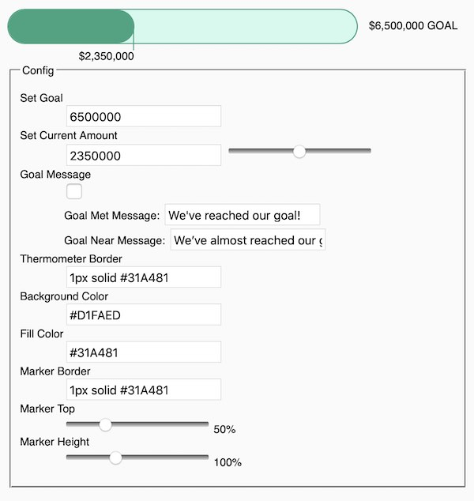

# Donation Banner Thermometer

The Internet Archive Donation Banner Thermometer



## Installation
```bash
npm i @internetarchive/donation-banner-thermometer
```

## Usage
```html
<script type="module">
  import '@internetarchive/donation-banner-thermometer';
</script>

<donation-banner-thermometer
  currentAmount="75000" goalAmount="150000">
</donation-banner-thermometer>
```

## Demo
Check out this repo and run:

```bash
> npm install
> npm run start
```

## Linting with ESLint, Prettier, and Types
To scan the project for linting errors, run
```bash
npm run lint
```

You can lint with ESLint and Prettier individually as well
```bash
npm run lint:eslint
```
```bash
npm run lint:prettier
```

To automatically fix many linting errors, run
```bash
npm run format
```

You can format using ESLint and Prettier individually as well
```bash
npm run format:eslint
```
```bash
npm run format:prettier
```

## Testing with Karma
To run the suite of karma tests, run
```bash
npm run test
```

To run the tests in watch mode (for <abbr title="test driven development">TDD</abbr>, for example), run

```bash
npm run test:watch
```


## Tooling configs

For most of the tools, the configuration is in the `package.json` to reduce the amount of files in your project.

If you customize the configuration a lot, you can consider moving them to individual files.

## Local Demo with `es-dev-server`
```bash
npm start
```
To run a local development server that serves the basic demo located in `demo/index.html`
