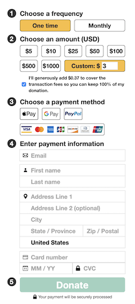

# \<donation-form>

The Internet Archive Donation Form



## Installation
```bash
yarn add @internetarchive/donation-form
```

## Usage
```html
<script type="module">
  import '@internetarchive/donation-form';
  import '@internetarchive/modal-manager';
  // create an endpoint manager that conforms to `BraintreeEndpointManagerInterface`
  import BraintreeEndpointManager from  './braintree-endpoint-manager.js';

  // instantiate the endpoint manager
  const endpointManager = new BraintreeEndpointManager();
  const formController = document.querySelector('donation-form-controller');
  const modalManager = document.querySelector('modal-manager');
  const recaptchaElement = document.querySelector('#recaptcha');

  // pass in all of the dependencies to the <donation-form-controller>
  formController.endpointManager = endpointManager;
  formController.modalManager = modalManager;
  formController.recaptchaElement = recaptchaElement;
  formController.analyticsHandler = window.archive_analytics;
</script>

<!--
  There's some environment-specific styling, depending on the host
  layout and configuration
-->
<style>
  donation-form-controller {
    min-height: 362px;
    display: block;
  }

  body.modal-manager-open {
    overflow: hidden;
  }

  modal-manager {
    display: none;
    --modalBottomMargin: 10px;
    --modalWidth: 320px;
  }

  modal-manager[mode='open'] {
    display: block;
  }

  #recaptcha {
    position: absolute;
    z-index: 10;
  }
</style>

<!--
  The <donation-form-controller> orchestrates the interactions
  between the donation-form itself and other dependencies like
  the modal manager, recaptcha, and some clear DOM dependencies
  like the PayPal button and Braintree hosted fields.

  The <donation-form> component can be used independently of the
  controller, but will need something to handle some of the interactions.
 -->
<donation-form-controller
  environment='dev/prod'
  braintreeAuthToken='{braintree_auth_token}'
  recaptchaSiteKey='{recaptcha_key}'
  venmoProfileId='{venmo_profile_id}'
  googlePayMerchantId='{google_merchant_id}'
  referrer='{referrer}'
  loggedInUser='{logged_in_user}'>
</donation-form-controller>

<div id="recaptcha"></div>

<modal-manager>
  <!--
    The PayPal button does not work in the shadow DOM so it
    must be slotted in from the top.
   -->
  <div slot="paypal-upsell-button">
    <div id="paypal-upsell-button"></div>
  </div>
</modal-manager>
```

# Development

## Prerequisite
```bash
yarn install
```

## Start Development Server
```bash
yarn run start
```

## Testing
```bash
yarn run test
```

## Linting
```bash
yarn lint
```
