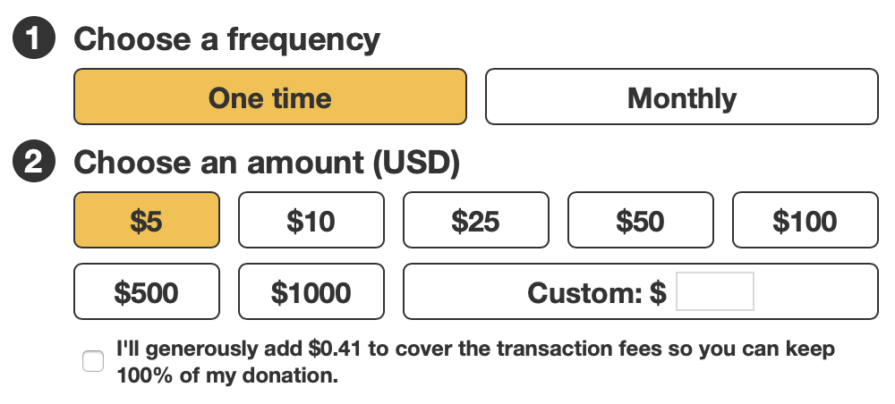

# \<iaux-donation-form-edit-donation>

The Internet Archive Donation Form Edit Donation Component




## Installation
```bash
yarn add @internetarchive/donation-form-edit-donation
```

## Usage
```html
<script type="module">
  import '@internetarchive/donation-form-edit-donation';
  import {
    DonationPaymentInfo,
    DonationType,
  } from '@internetarchive/donation-form-data-models';

  const donationInfo = new DonationPaymentInfo({
    amount: 5,
    donationType: DonationType.OneTime,
    coverFees: false,
  });
</script>

<donation-form-edit-donation
  .donationInfo=${donationInfo}
  @donationInfoChanged=${donationInfoChanged}
  @editDonationError=${editDonationError}
  stepNumberMode="shownumbers"
>
</donation-form-edit-donation>
```

## Linting with ESLint, Prettier, and Types
To scan the project for linting errors, run
```bash
yarn run lint
```

You can lint with ESLint and Prettier individually as well
```bash
yarn run lint:eslint
```
```bash
yarn run lint:prettier
```

To automatically fix many linting errors, run
```bash
yarn run format
```

You can format using ESLint and Prettier individually as well
```bash
yarn run format:eslint
```
```bash
yarn run format:prettier
```

## Testing with Karma
To run the suite of karma tests, run
```bash
yarn run test
```

To run the tests in watch mode (for <abbr title="test driven development">TDD</abbr>, for example), run

```bash
yarn run test:watch
```


## Tooling configs

For most of the tools, the configuration is in the `package.json` to reduce the amount of files in your project.

If you customize the configuration a lot, you can consider moving them to individual files.

## Local Demo with `es-dev-server`
```bash
yarn start
```
To run a local development server that serves the basic demo located in `demo/index.html`
